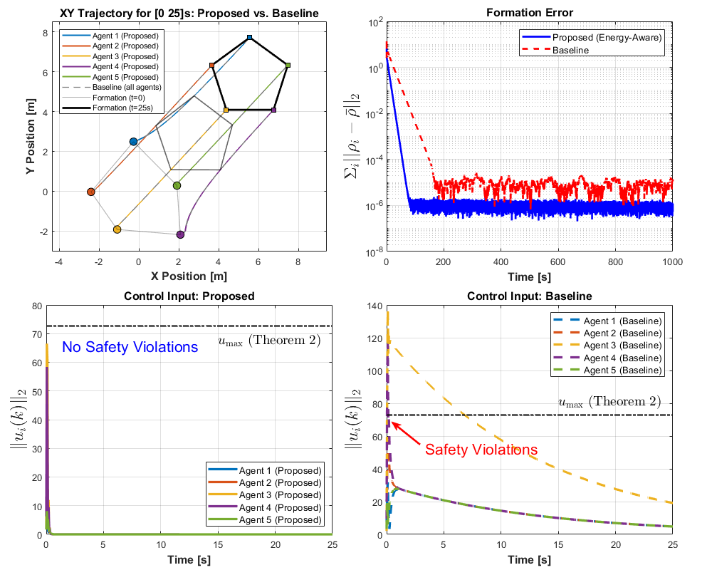
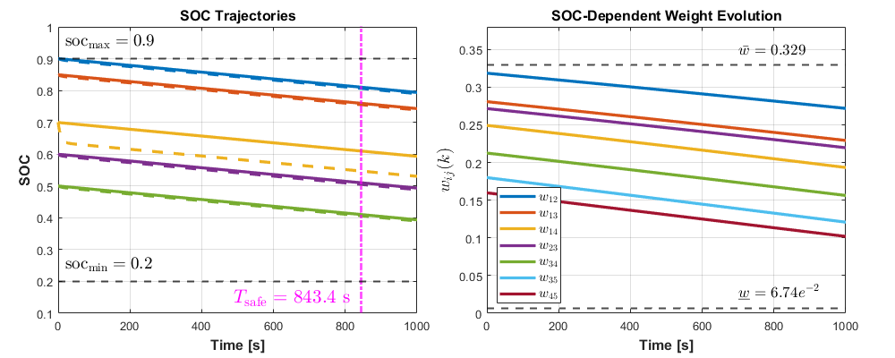

# Energy-Aware Consensus Control for Multi-Agent Systems via H∞/LMI Design

MATLAB implementation of an LMI-based energy-aware consensus control framework for
battery-powered multi-agent systems (MAS), with a *synthesis-derived* battery safety
guarantee (control input bound → C-rate bound → safe operation horizon).

> S. Hwang, G. Wu, M. Cho, and I. Hwang, "Energy-Aware Consensus Control for
> Multi-Agent Systems with Guaranteed Battery Safety via H-Infinity LMI Design,"
> *IEEE Control Systems Letters (L-CSS)*, 2026, Accepted.

## Key idea

Instead of treating battery state-of-charge (SOC) as an auxiliary online constraint,
this framework bakes energy-awareness directly into the consensus protocol:

1. **SOC-dependent interaction weights** attenuate the control effort of
   energy-depleted agents, producing a *time-varying* SOC-dependent Laplacian.
2. The Laplacian is bounded within a **polytopic set**, turning a time-varying
   synthesis problem into a finite set of vertex LMIs.
3. An **H∞ observer** (Lemma 1) and a **polytopic H∞ controller** (Theorem 1) are
   synthesized offline — no online optimization at runtime.
4. From the resulting Lyapunov certificate, a **three-layer battery safety
   guarantee** (Theorem 2) is derived *a posteriori*: control input bound → C-rate
   bound → certified safe operation horizon `T_safe`.

The controller/observer gains are then exported to a ROS2-ready YAML config
(`export_gains.m`), so the synthesized (and proven) gains can be dropped directly
into a robot control stack.

## Repo structure

```
Lemma1.m        H∞ observer gain synthesis (LMI)
Theorem1.m      Polytopic H∞ consensus controller gain synthesis (LMI)
Theorem2.m      Battery safety certificate: u_max, C-rate_max, T_safe
Simulation.m    5-agent pentagon formation simulation with heterogeneous SOC
export_gains.m  Exports synthesized gains/system matrices to gains.yaml (for ROS2 & Gazebo implementation)
main.m          Entry point — runs the full pipeline end to end
gains.yaml      Example exported output
```

## Software Requirements

- MATLAB R2024b (or later)
- [YALMIP](https://yalmip.github.io/)
- [MOSEK](https://www.mosek.com/) solver (free academic license available)

## Usage

```matlab
main
```

Running `main.m` executes the full pipeline — observer synthesis (Lemma 1),
controller synthesis (Theorem 1), battery safety certification (Theorem 2),
5-agent formation simulation, and YAML export — and reproduces the paper's
figures (trajectories, formation error, control input bounds, SOC trajectories,
SOC-dependent weight evolution).

## Simulation Results

The proposed energy-aware controller keeps every agent's control input strictly
below the certified bound `u_max` (Theorem 2) throughout the transient, while a
baseline using a fixed (SOC-agnostic) Laplacian violates that bound — translating
directly into a certified, computable safe operation horizon `T_safe` rather than
an empirical one.



*Top-left: pentagon formation trajectories over the first 25 s. Top-right: formation
error convergence. Bottom: per-agent control input norm — the proposed method stays
strictly below the certified bound `u_max` (Theorem 2), while the baseline violates
it during the transient.*



*Left: SOC trajectories under the proposed (solid) vs. baseline (dashed) approach —
all agents remain above `soc_min` well beyond the certified safe horizon
`T_safe = 843.4 s`. Right: evolution of the SOC-dependent interaction weights,
staying within the theoretical bounds `[w_under, w_upper]` throughout.*

## Citation

```bibtex
@article{hwang2026energyaware,
  author  = {Hwang, Sounghwan and Wu, Guanlin and Cho, Minhyun and Hwang, Inseok},
  title   = {Energy-Aware Consensus Control for Multi-Agent Systems with
             Guaranteed Battery Safety via H-Infinity LMI Design},
  journal = {IEEE Control Systems Letters},
  year    = {2026}
}
```
